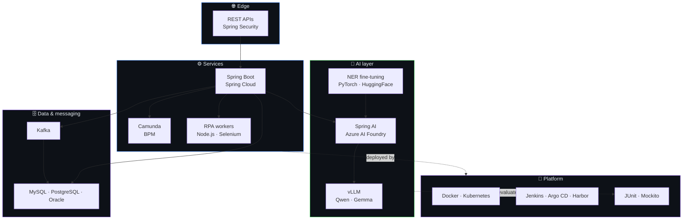

<div align="center">


<a href="https://github.com/noelmartinnez/noelmartinnez/blob/main/README.en.md"></a>
<a href="https://github.com/noelmartinnez#readme"></a>

<br/><br/>


</div>

---

I build **backend systems where AI has to actually hold up in production** — banking document pipelines, EU privacy tooling, regulated environments where "the model usually gets it right" is not an acceptable answer.

Most of my work is the unglamorous part around the model: microservices, schemas, evaluation, cost per inference. The model is one box in the diagram; the other twelve boxes are why it ships.

```
Alicante, Spain  ·  Java + Spring Boot + applied AI  ·  Spanish (native) / English (B1, improving daily)
```

---

## 🧭 Selected work

<table>
<tr>
<td width="50%" valign="top">

### 🛡️ PrivacyShield
**European AI anonymization SaaS** · Fundamentia

Fine-tuned NER models (PyTorch, Hugging Face) to **F1 90%**, then layered LLMs via Spring AI + Azure AI Foundry to reach **F1 99%** across 20+ entity types.

Led the backend: Java microservices, Spring Boot, Kafka, MySQL, versioned for Kubernetes. Tuned prompts against precision, recall, latency **and cost** — caching cut inference time and spend.

`Java` `Spring AI` `Kafka` `PyTorch` `Azure AI Foundry`

</td>
<td width="50%" valign="top">

### 🏦 SimplyData
**Intelligent Document Processing for banking** · Fundamentia

Java microservices plus open-source LLMs (**Qwen, Gemma**) served with **vLLM** for information extraction — running in a live production platform in the banking sector.

Self-hosted models, because sending client documents to a third-party API was never on the table.

`Java` `vLLM` `Qwen` `Gemma` `Document AI`

</td>
</tr>
<tr>
<td width="50%" valign="top">

### 🤖 Document RPA
**Automating administrative filings** · Fundamentia

Java + MySQL microservices streaming XML to Node.js RPA bots (Selenium, Puppeteer) that filled web forms automatically.

**~400 documents/month · ~100 manual hours saved.**

`Java` `Node.js` `Selenium` `Puppeteer`

</td>
<td width="50%" valign="top">

### 🏢 HUNTERS
**Corporate intranet** · Altia Consultores

Microservices in Java, Spring Boot and Spring Cloud over PostgreSQL and Oracle — schema design and query optimization included.

Modeled business processes with **Camunda (BPM)**, pushed test coverage to **85%** (JUnit, Mockito), shipped through Docker → Kubernetes with Jenkins, Harbor and Argo CD.

`Spring Cloud` `Camunda` `Argo CD` `Jenkins`

</td>
</tr>
</table>

---

## 🧪 Personal projects

<table>
<tr>
<td width="50%" valign="top">

#### [🖼️ ImgTwin](https://github.com/noelmartinnez/ImgTwin)

Detects and cleans up duplicate or near-identical images. Extracts embeddings with **MobileNet** (TensorFlow), reduces dimensionality with **PCA** and indexes them in **FAISS** for nearest-neighbour search. Ships with a UI to review and delete matches, and runs on CPU — no GPU required.

<a href="https://github.com/noelmartinnez/ImgTwin">   </a>

</td>
<td width="50%" valign="top">

#### [🚗 AutoBnB](https://github.com/noelmartinnez/AutoBnB)

Airbnb-style vehicle rental platform — **final degree project, graded 9/10**. Full-stack app in **Java, Spring Boot and Hibernate** over PostgreSQL: vehicle listings, search, time-slot booking and dynamic pricing.

<a href="https://github.com/noelmartinnez/AutoBnB">   </a>

</td>
</tr>
</table>

---

## 🧱 The stack, as a system

Not a wall of logos — this is roughly how the pieces I work with fit together.



<div align="center">

| | |
|---|---|
| **Languages** |     |
| **Backend** |     |
| **AI & LLMs** |      |
| **Data & messaging** |     |
| **Platform & testing** |      |

</div>

---

## 🐍 Contributions

<div align="center">

<picture>
  <source media="(prefers-color-scheme: dark)" srcset="https://raw.githubusercontent.com/noelmartinnez/noelmartinnez/output/github-snake-dark.svg" />
  
</picture>

</div>

---

## 📬 Get in touch

<div align="center">

<a href="https://noelmartinez.es"></a>
<a href="https://linkedin.com/in/noelmartinezpomares"></a>
<a href="mailto:noelmartinezpomares@gmail.com"></a>

<br/><br/>

<sub>Universidad de Alicante · BSc Computer Engineering, Software Engineering track</sub>


</div>
