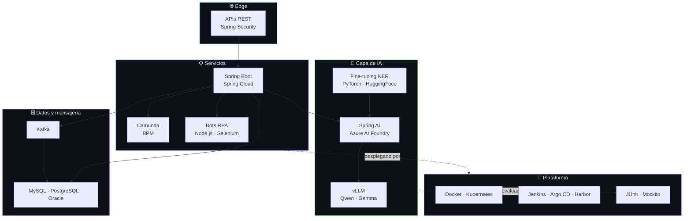

<div align="center">


<a href="https://github.com/noelmartinnez/noelmartinnez/blob/main/README.en.md"></a>
<a href="https://github.com/noelmartinnez#readme"></a>

<br/><br/>


</div>

---

Construyo **sistemas backend donde la IA tiene que aguantar en producción de verdad** — pipelines documentales para banca, herramientas europeas de privacidad, entornos regulados donde "el modelo suele acertar" no vale como respuesta.

La mayor parte de mi trabajo es la parte poco vistosa que rodea al modelo: microservicios, esquemas, evaluación, coste por inferencia. El modelo es una caja del diagrama; las otras doce son la razón de que llegue a producción.

```
Alicante, España  ·  Java + Spring Boot + IA aplicada  ·  Español (nativo) / Inglés (B1, mejorando a diario)
```

---

## 🧭 Trabajo destacado

<table>
<tr>
<td width="50%" valign="top">

### 🛡️ PrivacyShield
**SaaS europeo de anonimización con IA** · Fundamentia

Fine-tuning de modelos NER (PyTorch, Hugging Face) hasta **F1 90%**, y después capa de LLMs con Spring AI + Azure AI Foundry hasta **F1 99%** sobre más de 20 tipos de entidades.

Lideré el backend: microservicios Java, Spring Boot, Kafka y MySQL, versionados para Kubernetes. Optimicé prompts midiendo precision, recall, latencia **y coste** — la caché redujo tiempos y gasto de inferencia.

`Java` `Spring AI` `Kafka` `PyTorch` `Azure AI Foundry`

</td>
<td width="50%" valign="top">

### 🏦 SimplyData
**Intelligent Document Processing para banca** · Fundamentia

Microservicios Java junto a LLMs open-source (**Qwen, Gemma**) servidos con **vLLM** para extracción de información, en una plataforma en producción del sector bancario.

Modelos self-hosted, porque mandar documentos de cliente a una API de terceros nunca fue una opción.

`Java` `vLLM` `Qwen` `Gemma` `Document AI`

</td>
</tr>
<tr>
<td width="50%" valign="top">

### 🤖 RPA documental
**Automatización de trámites** · Fundamentia

Microservicios Java + MySQL que transmitían XML a bots RPA en Node.js (Selenium, Puppeteer) que rellenaban los trámites web automáticamente.

**~400 documentos/mes · ~100 horas manuales ahorradas.**

`Java` `Node.js` `Selenium` `Puppeteer`

</td>
<td width="50%" valign="top">

### 🏢 HUNTERS
**Intranet corporativa** · Altia Consultores

Microservicios en Java, Spring Boot y Spring Cloud sobre PostgreSQL y Oracle — diseño de esquemas y optimización de consultas incluidos.

Modelado de procesos de negocio con **Camunda (BPM)**, cobertura de tests hasta el **85%** (JUnit, Mockito), despliegue Docker → Kubernetes con Jenkins, Harbor y Argo CD.

`Spring Cloud` `Camunda` `Argo CD` `Jenkins`

</td>
</tr>
</table>

---

## 🧪 Proyectos propios

<table>
<tr>
<td width="50%" valign="top">

#### [🖼️ ImgTwin](https://github.com/noelmartinnez/ImgTwin)

Detección y limpieza de imágenes duplicadas o similares. Extrae embeddings con **MobileNet** (TensorFlow), reduce dimensionalidad con **PCA** e indexa en **FAISS** para búsqueda de vecinos cercanos. Incluye interfaz para revisar y borrar coincidencias, y corre en CPU sin necesidad de GPU.

<a href="https://github.com/noelmartinnez/ImgTwin">   </a>

</td>
<td width="50%" valign="top">

#### [🚗 AutoBnB](https://github.com/noelmartinnez/AutoBnB)

Plataforma de alquiler de vehículos estilo Airbnb — **TFG calificado con 9/10**. Aplicación full-stack en **Java, Spring Boot e Hibernate** sobre PostgreSQL: publicación de vehículos, búsqueda, reserva por franjas horarias y precios dinámicos.

<a href="https://github.com/noelmartinnez/AutoBnB">   </a>

</td>
</tr>
</table>

---

## 🧱 El stack, como sistema

No un muro de logos — así encajan más o menos las piezas con las que trabajo.



<div align="center">

| | |
|---|---|
| **Lenguajes** |     |
| **Backend** |     |
| **IA y LLMs** |      |
| **Datos y mensajería** |     |
| **Plataforma y testing** |      |

</div>

---

## 🐍 Contribuciones

<div align="center">

<picture>
  <source media="(prefers-color-scheme: dark)" srcset="https://raw.githubusercontent.com/noelmartinnez/noelmartinnez/output/github-snake-dark.svg" />
  
</picture>

</div>

---

## 📬 Contacto

<div align="center">

<a href="https://noelmartinez.es"></a>
<a href="https://linkedin.com/in/noelmartinezpomares"></a>
<a href="mailto:noelmartinezpomares@gmail.com"></a>

<br/><br/>

<sub>Universidad de Alicante · Grado en Ingeniería Informática, especialidad en Ingeniería del Software</sub>


</div>
