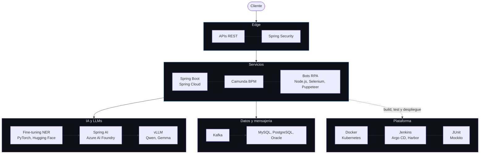

<div align="center">


<br/>


</div>

---

Construyo **sistemas backend donde la IA tiene que aguantar en producción de verdad**: pipelines documentales para banca, herramientas europeas de privacidad, entornos regulados donde "el modelo suele acertar" no vale como respuesta.

La mayor parte de mi trabajo es la parte poco vistosa que rodea al modelo: microservicios, esquemas, evaluación, coste por inferencia. El modelo es una caja del diagrama; las otras doce son la razón de que llegue a producción.

```
Alicante, España  ·  Java + Spring Boot + IA aplicada  ·  Español (nativo) / Inglés (B1, mejorando a diario)
```

---

## Trabajo destacado

<table>
<tr>
<td width="50%" valign="top">
<br/>

&nbsp;&nbsp;**PrivacyShield**<br/>
&nbsp;&nbsp;<sub>SaaS europeo de anonimización con IA</sub>

Fine-tuning de modelos NER (PyTorch, Hugging Face) hasta **F1 90%**, y después capa de LLMs con Spring AI y Azure AI Foundry hasta **F1 99%** sobre más de 20 tipos de entidades.

Lideré el backend: microservicios Java, Spring Boot, Kafka y MySQL, versionados para Kubernetes.

<br/>
</td>
<td width="50%" valign="top">
<br/>

&nbsp;&nbsp;**SimplyData**<br/>
&nbsp;&nbsp;<sub>Intelligent Document Processing para banca</sub>

Microservicios Java junto a LLMs open-source (Qwen, Gemma) servidos con vLLM para extracción de información, en una plataforma en producción del sector bancario.

<br/>
</td>
</tr>
<tr>
<td width="50%" valign="top">
<br/>

&nbsp;&nbsp;**RPA documental**<br/>
&nbsp;&nbsp;<sub>Automatización de trámites</sub>

Microservicios Java y MySQL que transmitían XML a bots RPA en Node.js (Selenium, Puppeteer) que rellenaban los trámites web automáticamente.

&nbsp;&nbsp;**~400 documentos al mes** y **~100 horas manuales ahorradas**.

<br/>
</td>
<td width="50%" valign="top">
<br/>

&nbsp;&nbsp;**HUNTERS**<br/>
&nbsp;&nbsp;<sub>Intranet corporativa</sub>

Microservicios en Java, Spring Boot y Spring Cloud sobre PostgreSQL y Oracle, con diseño de esquemas y optimización de consultas.

Modelado de procesos de negocio con Camunda (BPM), cobertura de tests hasta el **85%** (JUnit, Mockito), despliegue Docker sobre Kubernetes con Jenkins, Harbor y Argo CD.

<br/>
</td>
</tr>
</table>

---

## Proyectos propios

<table>
<tr>
<td width="50%" valign="top">
<br/>

&nbsp;&nbsp;**[ImgTwin](https://github.com/noelmartinnez/ImgTwin)**

Detección y limpieza de imágenes duplicadas o similares.

Extrae embeddings con MobileNet (TensorFlow), reduce dimensionalidad con PCA e indexa en FAISS para búsqueda de vecinos cercanos.

Incluye interfaz para revisar y borrar coincidencias, y corre en CPU sin necesidad de GPU.

&nbsp;&nbsp;   

<br/>
</td>
<td width="50%" valign="top">
<br/>

&nbsp;&nbsp;**[AutoBnB](https://github.com/noelmartinnez/AutoBnB)**

TFG calificado con 9/10.

Plataforma de alquiler de vehículos estilo Airbnb.

Aplicación full-stack en Java, Spring Boot e Hibernate sobre PostgreSQL: publicación de vehículos, búsqueda, reserva por franjas horarias y precios dinámicos.

&nbsp;&nbsp;   

<br/>
</td>
</tr>
</table>

---

## Competencias Técnicas



<div align="center">

| | |
|---|---|
| **Lenguajes** |   -0d1117?style=flat-square&logo=nodedotjs&logoColor=339933)  |
| **Backend** |     -0d1117?style=flat-square&logo=camunda&logoColor=fc5d0d)   |
| **Datos y Mensajería** |     |
| **IA y LLMs** |        |
| **DevOps, Testing y RPA** |          |

</div>

---

<div align="center">

<picture>
  <source media="(prefers-color-scheme: dark)" srcset="https://raw.githubusercontent.com/noelmartinnez/noelmartinnez/output/github-snake-dark.svg" />
  
</picture>

</div>

---

## Contacto

<div align="center">

<a href="https://noelmartinez.es"></a>
&nbsp;
<a href="https://linkedin.com/in/noelmartinezpomares"></a>
&nbsp;
<a href="mailto:noelmartinezpomares@gmail.com"></a>

<br/><br/>

<sub>Universidad de Alicante · Grado en Ingeniería Informática, especialidad en Ingeniería del Software</sub>


</div>
