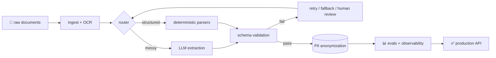

<!-- ═══════════════════════════════════════════════════════════════
     noelmartinnez · profile runtime v2026.09
     This README is rendered as an agent trace. Read it top to bottom.
     ═══════════════════════════════════════════════════════════════ -->

<div align="center">


<a href="https://noelmartinez.es">
  
</a>

<br/>

<a href="https://noelmartinez.es"></a>
<a href="https://linkedin.com/in/noelmartinezpomares"></a>


</div>

---

### `▍ system_prompt`

```yaml
agent: noel.martinez
role: Backend Software Engineer
specialization: applied AI — LLMs that have to survive production, not just demos
languages: [es-ES (native), en (training daily 🏋️)]
principles:
  - boring infra, clever product
  - if it's not observable, it's not deployed
  - measure the model, don't trust the vibe
  - consistency > intensity   # learned this under a barbell, applies to code too
```

---

### `▍ trace` &nbsp; <sub>click each step to expand</sub>

<details>
<summary><code>🛠️ tool_call → experience.query(sort="recent")</code></summary>
<br/>

```json
[
  {
    "company": "Fundamentia",
    "role": "Backend Software Engineer",
    "period": "2025-03 → 2026-08",
    "shipped": [
      "SimplyData — Intelligent Document Processing running in production at major Spanish banks",
      "Lead backend dev on a European project: AI/LLM-powered entity anonymization"
    ],
    "context": "mission-critical, regulated, zero tolerance for silent failures"
  },
  {
    "company": "Altia",
    "role": "Backend & Infrastructure Engineer",
    "period": "2024-09 → 2025-03"
  },
  {
    "education": "BSc Computer Engineering — Universidad de Alicante",
    "thesis": "9/10"
  }
]
```

</details>

<details>
<summary><code>🧠 tool_call → architecture.render("how I think about LLM pipelines")</code></summary>
<br/>



> [!NOTE]
> The LLM is one box in the diagram. Everything around it is what makes it shippable.

</details>

<details>
<summary><code>🧰 tool_call → stack.list()</code></summary>
<br/>

<p align="center">
  
</p>

`llms` · `rag` · `structured outputs` · `evals` · `pii anonymization` · `document ai` · `rest apis` · `ci/cd`

</details>

<details>
<summary><code>🔭 tool_call → now.get()</code></summary>
<br/>

```diff
+ building personal projects around agents, evals and document AI
+ going deeper on distributed systems and LLM infra
+ english: daily reps, same as the gym
! open to conversations: backend with real applied AI, Alicante/Elche, hybrid or remote
```

</details>

<details>
<summary><code>🏋️ tool_call → offline_mode.status()</code></summary>
<br/>

```text
┌──────────────────────────────────────────────┐
│  when not shipping code: training.            │
│  same rules apply → progressive overload,     │
│  recovery, no skipped sessions.               │
│  most of my best debugging happens mid-set.   │
└──────────────────────────────────────────────┘
```

</details>

---

### `▍ telemetry`

<div align="center">

<picture>
  <source media="(prefers-color-scheme: dark)" srcset="https://raw.githubusercontent.com/noelmartinnez/noelmartinnez/output/github-snake-dark.svg" />
  
</picture>

</div>

---

### `▍ user_input`

<div align="center">

Got a question, an idea or a role? Prompt me directly — it opens an issue in this repo and I answer every one.

<a href="https://github.com/noelmartinnez/noelmartinnez/issues/new?title=%5Bprompt%5D%20&body=Hi%20Noel%2C%20">
  
</a>

<br/><br/>

<sub><code>response.finish_reason = "stop"</code> · tokens well spent · thanks for reading</sub>


</div>
